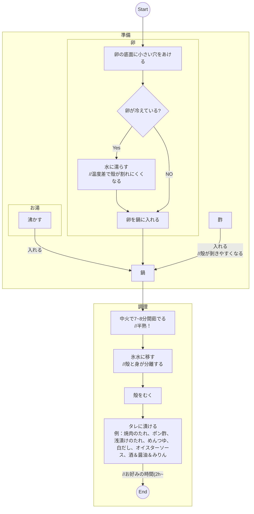

```mermaid
flowchart TD

start((Start)) --> 卵の底面に小さい穴をあける

subgraph 準備
    鍋
    subgraph 卵
        卵の底面に小さい穴をあける-->
        if1{卵が冷えている?}-- Yes-->action[水に濡らす<br>//温度差で殻が割れにくくなる] -->B
        if1 -- NO--> B[卵を鍋に入れる]
    end
    subgraph お湯
        沸かす
    end
    沸かす--入れる--> 鍋
    B-->鍋
    酢 --入れる<br>//殻が剝きやすくなる-->鍋
end


subgraph 調理
    鍋 --> D[中火で7~8分間茹でる<br>//半熟！]
    D --> G[氷水に移す<br>//殻と身が分離する]
    G --> H[殻をむく]
    H --> I[タレに漬ける<br>例：焼肉のたれ、ポン酢、浅漬けのたれ、めんつゆ、白だし、オイスターソース、酒＆醤油＆みりん]--//お好みの時間(2h~--> End((End))
end

```
